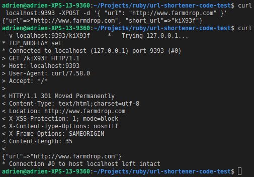

[](https://travis-ci.org/AdrienFabre/url-shortener) [](https://coveralls.io/github/AdrienFabre/url-shortener?branch=master)

# Url Shortener

This program helps users to create a short URL from any URL.

## View


## Endpoint



## User Story

As a user,
So I can create user friendly concise URLs,
I want to be able to paste my URL and get returned a short URL.

### Edge cases

The user can provide the URL with or without `http://`.

## Parameters

This programme needs to store many shorts URLs. We need to find a balance between the number of possibilities and the number of characters.

Enabling a-z, A-Z and 0-9 would enable 62 possible characters. With 6 characters, we could generate 6^62 short urls, so 56 800 235 584.

If we need more, we could remove links that have not been visited for over 6 months.

## Installation

```bash
bundle install
```

## Run App

```bash
shotgun config.ru
```

Run on: [http://localhost:9393/](http://localhost:9393/)

When a url is shorthened, the file 'url_pairs.json' will be created and data will be stored.

## Run Tests

```bash
rspec
```

When the test is running, the file 'url_pairs_test.json' will be created and data will be stored, then the file will be automatically deleted.

### Results

```bash
Controller: UrlShortener
  displays home page
  redirects to saved url

Scenario: user shortens a url
  user can see instructions on the homepage
  user can paste an url an receive a short url
  user can visit the new created link to be redirected
  user can click on the new created link to be redirected
  user can read a message if empty url is submited
  user read a message if unvalid url is submited

Shortener
  creates and binds a short url when the url is new
  retrieves the short url when the url was saved
  retrieves a url by the short url

Finished in 0.1631 seconds (files took 0.54503 seconds to load)
11 examples, 0 failures
```

## Run auto formater

```bash
bundle exec rbprettier --write '**/*.rb'
```
